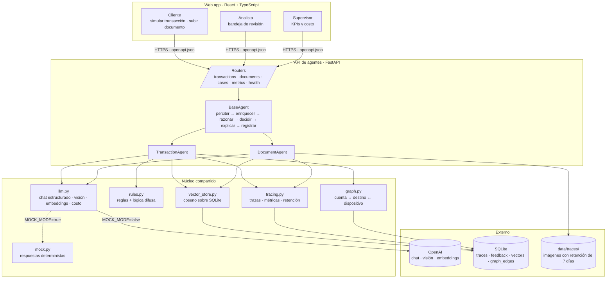
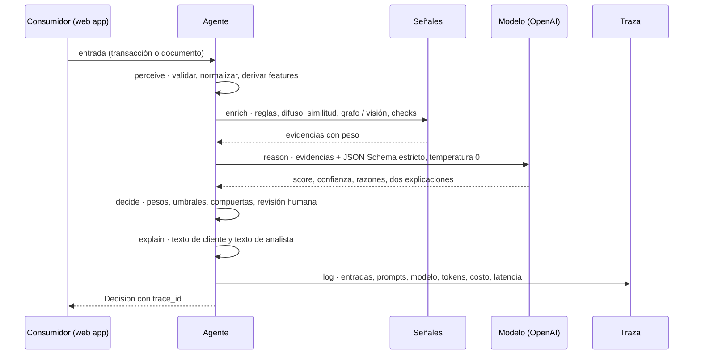
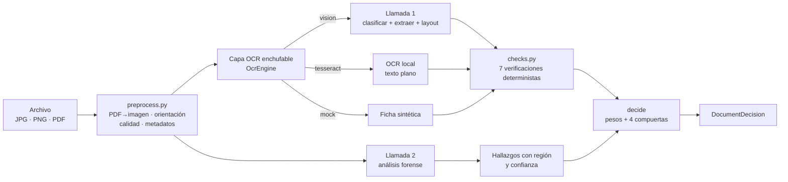
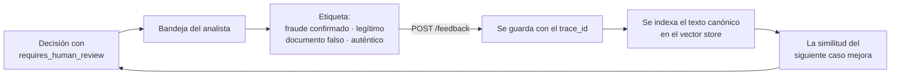

# Arquitectura

## Vista de componentes

## El ciclo del agente

Ambos procesos recorren el mismo ciclo. Lo que cambia son las señales que
enriquecen la decisión y los umbrales de negocio.

El modelo **no decide**: razona sobre evidencias ya calculadas y devuelve un JSON
validado. Los umbrales, los pesos y las compuertas viven en código, no en el
prompt. Esto es lo que hace la decisión auditable.

## Flujo de las dos señales de visión

Nunca se envía el documento al modelo más de **dos veces** por evaluación: la
extracción y el forense. La comparación de firma es una tercera llamada solo
cuando se entrega un `reference_id`, y usa la página ya procesada.

## Ciclo de aprendizaje

No se reentrena ningún modelo: basta con actualizar la memoria de casos que
alimenta la búsqueda por coseno. Es el ciclo «fraude → investigación →
etiquetado → evaluación» implementado con el costo de un embedding.

## Decisiones estructurales

| Decisión | Por qué |
|---|---|
| Un solo esquema de salida (`Decision`) para ambos procesos | Simplifica el front y la auditoría: una sola forma que aprender, una sola tabla que consultar |
| El front nunca llama a OpenAI | Toda la inteligencia y todo el costo quedan trazados en un solo lugar |
| `MOCK_MODE` en el cliente LLM, no en los agentes | El pipeline es idéntico con y sin red; lo único que cambia es de dónde viene la respuesta |
| Vector store detrás de una interfaz | SQLite + NumPy alcanza hasta ~10⁴ vectores; migrar a pgvector es cambiar una clase |
| Persistencia de imágenes solo en `data/traces/` con retención | Un único lugar que auditar y purgar |
| Modo sombra en `BaseAgent`, no en cada agente | Un piloto sin bloqueos no debe depender de que cada agente recuerde implementarlo |

## Límites conocidos

- Un embedding de texto captura **patrones descritos**, no la firma exacta de un
  fraude nuevo. La similitud ayuda a reconocer lo ya visto, no a anticipar lo
  inédito.
- La visión detecta señales **visibles**. Falla ante fotos de pantalla,
  hologramas y documentos de muy baja calidad; por eso existe la compuerta de
  calidad.
- El «grafo» son dos consultas de ventana móvil sobre una tabla de aristas, no un
  motor de grafos. Detecta cuenta recolectora y dispositivo compartido; no
  detecta anillos ni caminos largos.
- Los pesos y umbrales son valores iniciales. Exigen calibración con línea base y
  piloto en modo sombra antes de bloquear a nadie.
